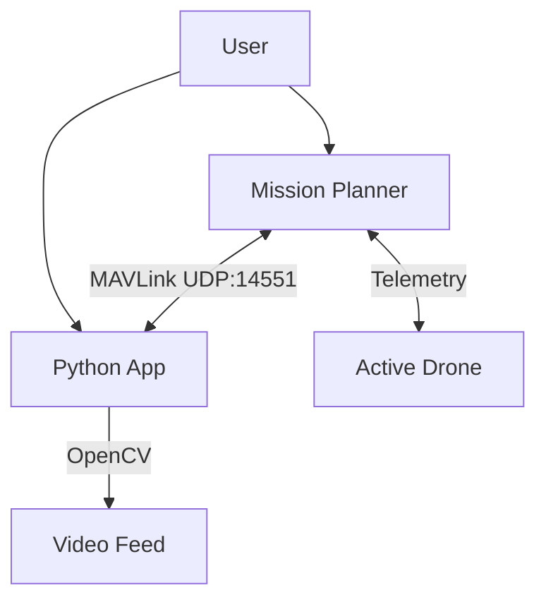

# AGROS Mission Planner - System Architecture

## 1. COMPLETE AUTONOMOUS OPERATION FLOW
*(Precision Agriculture – Two Drones, One Active at a Time)*

### 🧠 Core Design Principle
> **Mission Planner remains the primary GCS and safety authority.**
> Python acts as an **intelligent mission assistant**, not a flight controller.
> *Aligns with Rule 9 (Failsafe & Safety) and Phase 1A scoring.*

---

## 2. SYSTEM ROLES

### 🔹 Scan Drone (Drone-1)
*   **Purpose:** Detect stressed crops and geotag
*   **Payload:** RGB camera
*   **Mode:** Fully autonomous
*   **Output:** Detection JSON + screenshots

### 🔹 Spray Drone (Drone-2)
*   **Purpose:** Precision spraying
*   **Payload:** Sprayer + pump
*   **Mode:** Fully autonomous
*   **Input:** Approved detection IDs

*⚠️ Only one drone powered at a time*

---

## 3. Ground Control Station Interface
**Mission Planner (GCS)**
*   Vehicle state
*   Map view
*   Geofence
*   RTL / Pause / Resume
*   KML Area upload

**Python Control App**
*   OpenCV detection (Scan Receiver)
*   Yellow pigment detection & Confidence scoring
*   Geotagging via MAVLink GPS
*   Detection Database (JSON/Images)
*   Human-in-the-loop Approval GUI
*   Spray Mission Generator

---

## 4. AUTONOMOUS FLIGHT FLOW

### 🟢 PHASE A – SCAN DRONE OPERATION
1.  **Mission Upload**: Upload KML Area in Mission Planner. Python converts to grid scan.
2.  **Autonomous Scan**:
    *   Mode: `AUTO`
    *   **Proccess**: Frame → OpenCV → Yellow Detection → GPS Tag → Save ID/Image.
    *   **Output**: `detections/AGRI_001.json`, `detections/AGRI_001.jpg`
3.  **Completion**: Drone RTL -> Land -> Disarm -> Power OFF.

### 🟡 PHASE B – HUMAN-IN-THE-LOOP APPROVAL
*   **Mandatory & Scored Step**
*   Python GUI displays detected targets.
*   Operator approves (☑) or rejects (❌) each ID.

| ID | Image | Confidence | Action |
| :--- | :--- | :--- | :--- |
| AGRI_001 | 🖼️ | 0.87 | ☑ Approve |
| AGRI_002 | 🖼️ | 0.61 | ❌ Reject |

### 🟢 PHASE C – SPRAY DRONE OPERATION
1.  **Mission Generation**:
    *   For each approved ID: Fly to Target → Loiter → Spray (Servo ON) → Servo OFF → Next.
2.  **Execution**:
    *   Upload via Mission Planner.
    *   Mode: `AUTO`.
    *   Ends with RTL -> Land.

---

## 5. FAILSAFE STRATEGY
| Condition | Action |
| :--- | :--- |
| RC / Telemetry lost | RTL |
| Low battery | RTL |
| Geofence breach | RTL |
| Mission abort | RTL |
| Emergency | LAND |

**Never hover indefinitely.**
